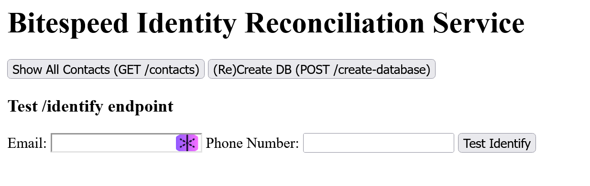
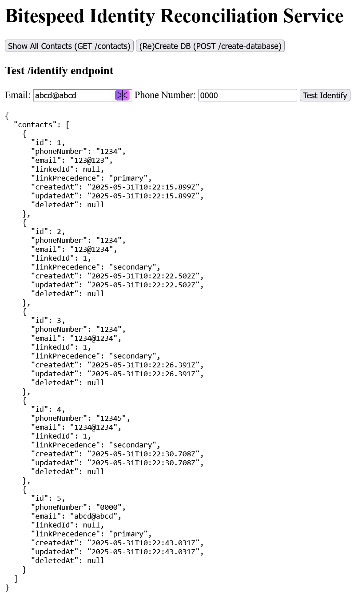

# Bitespeed Backend Task: Identity Reconciliation

This project implements the Bitespeed identity reconciliation backend service using Node.js, Express, TypeScript, and SQLite.

## Features

- `/identify` endpoint for identity reconciliation as per Bitespeed requirements.
- `/contacts` endpoint to view all contacts in the database.
- `/create-database` endpoint to (re)create the Contact table.
- Simple web UI at `/` for testing endpoints.

## Setup

1. **Install dependencies:**
   ```
   npm install
   ```

2. **Run the server:**
   ```
   npm run dev
   ```
   or
   ```
   npm start
   ```

3. **Access the service:**
- Open [http://localhost:3000](http://localhost:3000) in your browser to access the test UI.

<p align="center">
    
</p>

<p align="center">
    
</p>

## API Endpoints

- `POST /identify`  
  Identify or create a contact.  
  **Body:**  
  ```json
  {
    "email": "example@email.com",
    "phoneNumber": "1234567890"
  }
  ```

- `GET /contacts`  
  List all contacts in the database.

- `POST /create-database`  
  (Re)create the Contact table.

## Live Demo

The deployed API is accessible at: https://bitespeed-assignment-n5sh.onrender.com/